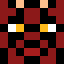
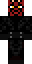
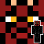

# Minecraft Avatars in PHP

This is a set of PHP classes which you can use to generate fine-looking avatars from Minecraft skins.

## Types

There are currently 4 different types available.

#### Avatar

Generates image from the face region of player's Minecraft skin.



#### Skin

Generates image from the body region (front) of player's Minecraft skin.



#### Combo

Generates image combining face and body region of player's Minecraft skin.



#### Isometric

Generates 3D-like image from the head region of player's Minecraft skin.


## Usage

```php
require_once("avatar.class.php");

$avatar = new Avatar("The_HusKy", 64);
$avatar->show()
```

## License

MIT. See `LICENSE`.
